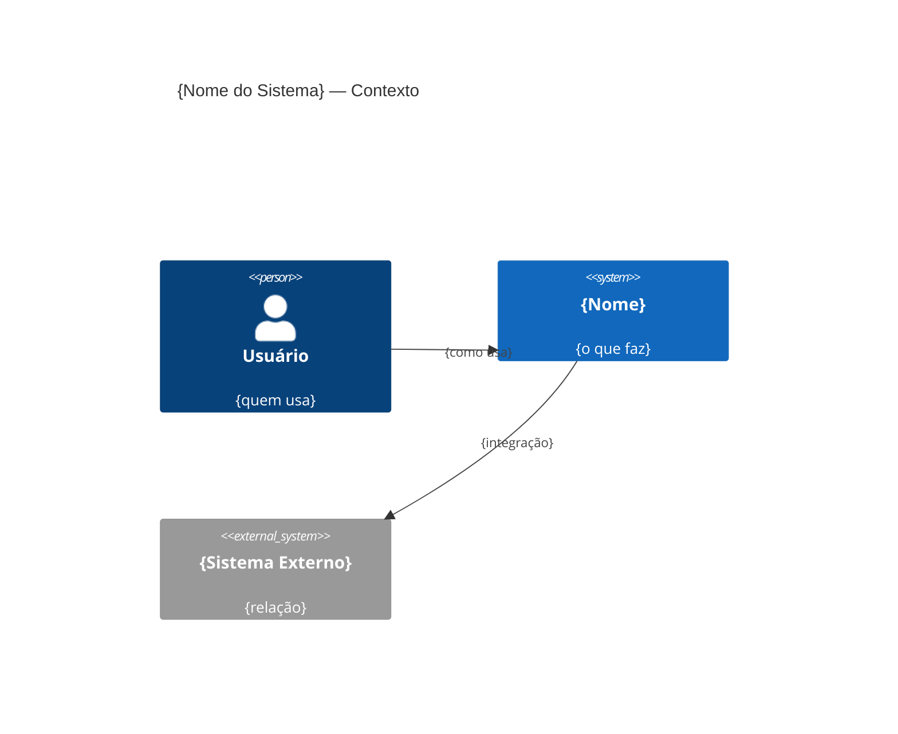
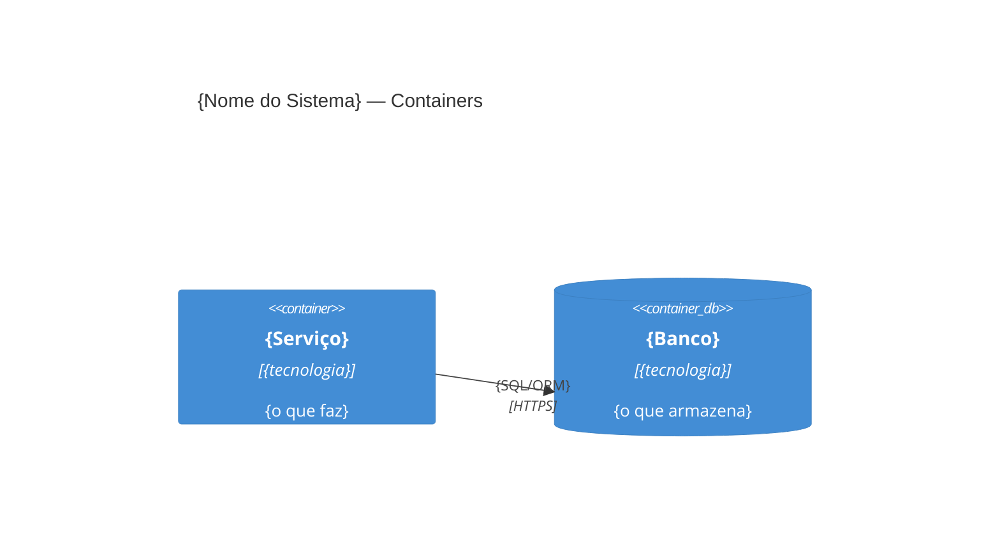

# Templates de Artefatos — teczi-discovery-software

> Referência de templates para cada documento produzido pelo discovery.
> Cada documento deve ter o header de **Estado** antes de qualquer conteúdo.

---

## Header Obrigatório em Todo Documento

```markdown
> **Estado:** Verificado em produção | Pretendido (não verificado) | Inferido (confirmar com humano)
> **Sistema:** {system-slug}
> **Fase:** {fase-número} — {nome-da-fase}
> **Atualizado:** {YYYY-MM-DD}
```

---

## `_brief.md` — AI Entry Point (OBRIGATÓRIO)

Documento comprimido para consumo por IA. Máximo 4.000 tokens. Sem prosa desnecessária.

```markdown
---
type: brief
system: {system-slug}
updated: {YYYY-MM-DD}
---

> **Estado:** Verificado em produção
> **Sistema:** {system-slug}

# {Nome do Sistema} — Brief

## 1. O que este sistema faz

{1 parágrafo descrevendo o propósito central — sem história, sem contexto desnecessário}

## 2. Stack principal

- **Runtime:** {linguagem + versão}
- **Framework:** {framework principal}
- **Banco de dados:** {banco + ORM}
- **Infraestrutura:** {cloud/plataforma}
- **Integrações externas principais:** {lista}

## 3. Entidades centrais do domínio

| Entidade | Descrição (1 linha) | Relações principais |
|---|---|---|
| {Entidade} | {O que representa} | {com o que se relaciona} |

## 4. Regras de negócio fundamentais

1. **{Nome da Regra}** — {trigger} → {comportamento}
2. **{Nome da Regra}** — {trigger} → {comportamento}
3. **{Nome da Regra}** — {trigger} → {comportamento}

## 5. Pontos de entrada principais

- `{MÉTODO /path}` — {o que faz} ({autenticado/público})
- `{worker/job}` — {o que processa} ({frequência})

## 6. O que NÃO fazer neste sistema

- Não {anti-pattern específico deste sistema}
- Não {convenção violada}
- Não {padrão proibido}

## 7. Onde encontrar mais detalhe

| Tópico | Documento |
|---|---|
| Regras de negócio completas | `02-domínio/regras-de-negócio.md` |
| Arquitetura | `03-arquitetura/visão-geral.md` |
| Setup de desenvolvimento | `08-desenvolvimento/setup.md` |
| Segurança | `07-segurança/auth-authz.md` |
| O que não foi descoberto | `GAPS.md` |
```

---

## `README.md` — Humano Entry Point

```markdown
---
type: overview
system: {system-slug}
updated: {YYYY-MM-DD}
---

# {Nome do Sistema}

> {1 frase descrevendo o sistema}

## O que é

{2-3 parágrafos com contexto, propósito e usuários. Para humanos — pode ter narrativa.}

## Stack

{lista de tecnologias}

## Como rodar localmente

Ver: `08-desenvolvimento/setup.md`

## Estrutura deste repositório de discovery

| Diretório | Conteúdo |
|---|---|
| `00-reconhecimento/` | Snapshot inicial, stack inferida, contexto temporal |
| `01-identidade/` | Propósito, usuários, escopo |
| `02-domínio/` | Glossário, regras de negócio, jornadas |
| `03-arquitetura/` | C4, componentes, decisões, real vs. pretendido |
| `04-stack/` | Tecnologias, dependências, trade-offs |
| `05-dados/` | Schema, migrations, fluxos |
| `06-infraestrutura/` | Ambientes, CI/CD, observabilidade |
| `07-segurança/` | Superfície de ataque, auth, dados sensíveis |
| `08-desenvolvimento/` | Setup, estrutura, padrões, testes, debug |
| `09-evolução/` | Histórico, débitos, pontos de inflexão |

## Gaps e incertezas

Ver: `GAPS.md`

## AI Entry Point

Ver: `_brief.md`
```

---

## `GAPS.md` — O que não foi descoberto

```markdown
---
type: gaps
system: {system-slug}
updated: {YYYY-MM-DD}
---

> **Estado:** Verificado — este documento cataloga o que não foi verificado.
> **Sistema:** {system-slug}

# GAPS — {Nome do Sistema}

Este documento cataloga o que não foi possível descobrir no discovery e por quê.
Uma IA que consumir a documentação deste sistema NÃO deve inferir o que está aqui — deve declarar que não sabe.

## Gaps por categoria

### Domínio

- [ ] **{Regra não descoberta}** — {por que não foi possível descobrir}
- [ ] **{Fluxo de negócio obscuro}** — {código não encontrado / lógica em serviço externo}

### Arquitetura

- [ ] **{Componente não mapeado}** — {sem acesso ao repositório / código ofuscado}

### Infraestrutura

- [ ] **{Ambiente não documentado}** — {sem acesso às variáveis de staging}

### Segurança

- [ ] **{Controle não verificado}** — {não foi possível verificar implementação real}

### Dados

- [ ] **{Tabela sem contexto}** — {estrutura encontrada mas propósito não identificado}

## Itens que precisam de validação humana

- [ ] **{Afirmação inferida}** — verificar com {quem ou onde}
- [ ] **{Decisão técnica assumida}** — confirmar se ainda é válida

## Próximas escavações

Lista de itens que o Howard deixou para uma segunda passagem:

- [ ] {item} — {por que ficou para depois}
```

---

## `02-domínio/glossário.md`

```markdown
> **Estado:** Verificado em produção
> **Sistema:** {system-slug}

# Glossário — {Nome do Sistema}

Termos do domínio com significado específico neste sistema.
Termos genéricos (user, email, id) não entram a menos que tenham semântica especial.

| Termo | Definição no contexto deste sistema | Usado em |
|---|---|---|
| {Termo} | {O que significa aqui} | {arquivos/módulos} |
```

---

## `02-domínio/regras-de-negócio.md`

```markdown
> **Estado:** Verificado em produção / Inferido (marcado individualmente)
> **Sistema:** {system-slug}

# Regras de Negócio — {Nome do Sistema}

Cada regra tem nome, trigger, comportamento e exceções.
Regras inferidas (não encontradas explicitamente no código) são marcadas com ⚠️ INFERIDO.

---

### RN-001: {Nome da Regra}

> **Estado:** Verificado em produção
> **Origem:** {Lei/Contrato/Decisão de negócio/Implícita no código}
> **Localização:** `{path/arquivo.ts:linha}`

- **Trigger:** {O que dispara}
- **Comportamento:** {O que acontece}
- **Exceções:** {Quando não se aplica}

---

### RN-002: {Nome da Regra}

> **Estado:** ⚠️ INFERIDO — confirmar com responsável
...
```

---

## `03-arquitetura/visão-geral.md`

```markdown
> **Estado:** Verificado em produção
> **Sistema:** {system-slug}

# Arquitetura — {Nome do Sistema}

## C4 — Nível 1: Contexto



## C4 — Nível 2: Containers



## Módulos e seus papéis

| Módulo/Diretório | Papel |
|---|---|
| `{módulo}` | {o que faz em 1 linha} |

## Padrão arquitetural identificado

{MVC / Hexagonal / Layered / Event-driven / Sem padrão claro}
{Evidências que levaram a essa conclusão}
```

---

## `03-arquitetura/real-vs-pretendido.md`

```markdown
> **Estado:** Análise de divergência — verificado com código real
> **Sistema:** {system-slug}

# Arquitetura Real vs. Pretendida

## O que foi pretendido

{Baseado em README, diagrama, comentários ou estrutura inicial de pastas}

## O que existe em produção

{O que Howard encontrou de fato}

## Divergências documentadas

| Área | Pretendido | Real | Impacto |
|---|---|---|---|
| {Camada} | {o que deveria ser} | {o que é} | {baixo/médio/alto} |

## Débitos arquiteturais desta divergência

{Lista de débitos gerados pela diferença entre intenção e realidade}
```

---

## `08-desenvolvimento/setup.md`

```markdown
> **Estado:** Verificado localmente
> **Sistema:** {system-slug}

# Setup de Desenvolvimento

## Pré-requisitos

- {runtime} {versão mínima}
- {ferramenta} {versão}

## Instalação

```bash
# Clonar
git clone {url}
cd {diretório}

# Instalar dependências
{npm install / pip install -r requirements.txt / go mod download}

# Configurar variáveis de ambiente
cp .env.example .env
# Editar .env com valores locais

# Banco de dados
{comando de setup do banco}
{comando de migrations}

# Rodar
{comando para iniciar}
```

## Verificar que está funcionando

```bash
{comando de health check}
# Resposta esperada: {o que deve aparecer}
```

## Problemas comuns

| Sintoma | Causa | Solução |
|---|---|---|
| {erro} | {causa} | {como resolver} |
```

---

## Mapeamento Codex: Estrutura Local → Objetos Codex

| Estrutura Local | Tipo Codex | Slug Codex |
|---|---|---|
| `{system-slug}/` | `System` | `{system-slug}` |
| `{system-slug}/_brief.md` | `Document` (raiz do System) | `brief` |
| `{system-slug}/README.md` | `Document` (raiz do System) | `readme` |
| `{system-slug}/GAPS.md` | `Document` (raiz do System) | `gaps` |
| `{system-slug}/00-reconhecimento/` | `Folder` | `00-reconhecimento` |
| `{system-slug}/00-reconhecimento/snapshot.md` | `Document` | `snapshot` |
| `{system-slug}/02-domínio/` | `Folder` | `02-dominio` |
| `{system-slug}/02-domínio/glossário.md` | `Document` | `glossario` |
| `{system-slug}/02-domínio/regras-de-negócio.md` | `Document` (type: `spec`) | `regras-de-negocio` |
| `{system-slug}/03-arquitetura/visão-geral.md` | `Document` (type: `overview`) | `visao-geral` |
| `{system-slug}/03-arquitetura/decisões.md` | `Document` (type: `adr`) | `decisoes` |
| `{system-slug}/08-desenvolvimento/setup.md` | `Document` (type: `runbook`) | `setup` |

**Slugs no Codex:** usar kebab-case ASCII — remover acentos para slugs.
Exemplo: `02-domínio` → folder slug `02-dominio`, `glossário.md` → document slug `glossario`.
