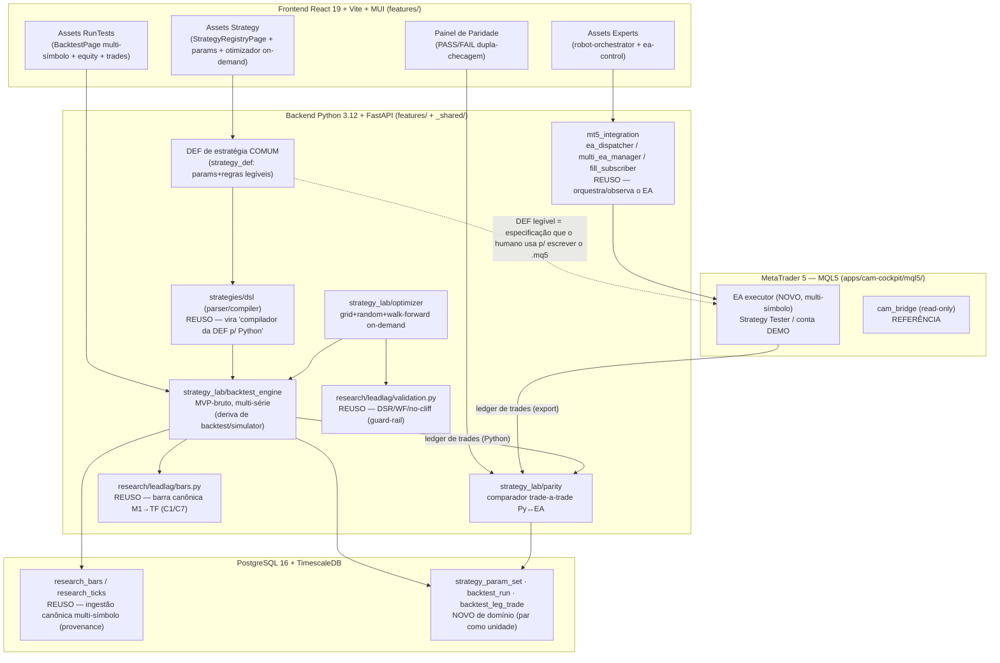

# ARCH — StrategyLab do CaM · A Tríade Assets Strategy + RunTests + Experts

> **DAS-lite da tríade.** Este documento fixa a topologia da solução, os fluxos
> principais, onde cada peça mora no Vertical Slice + Shared Kernel, o reuso do
> estado real e o encaixe das três decisões caras (ADR-SL-01/02/03). Não é
> inventário do código existente (isso é SDOC) — é **decisão de arquitetura**.

---

## 0. A virada que governa todo o resto

A nota de ARCH anterior (`ARCH-NOTE-PARIDADE-EA-PYTHON.md`) recomendava **modelo (a):
spec declarativa única + dupla implementação + suíte de paridade**, e **diferia
codegen/DSL** (modelo (c)) para "quando 3+ estratégias convergirem". O Founder
**fechou a porta do codegen de vez** (Q3, verbatim): *"o codegen não teremos pela
aplicação, não quero dupla implementação Python para CAM e EA... vamos de backtests
em 2 locais... redundância para segurança"*.

**Leitura arquitetural (acatada):** o eixo deixa de ser "espelho gerado" e passa a
ser **redundância dissimilar / N-version programming**. Duas implementações da mesma
estratégia, escritas **por caminhos diferentes e de propósito** — (1) Python no CAM,
(2) MQL5 no EA — sem nenhuma gerar a outra. A "paridade" deixa de ser garantia por
construção e vira **dupla checagem independente**: se os dois backtests convergem nos
valores brutos, há confiança; se divergem, há bug em um dos dois. A camada de paridade
é o **detector de dessincronização** — e é o que paga a conta da redundância.

Isto fecha no **ADR-SL-01**. As consequências de manutenção (duas implementações
sincronizadas à mão) são reais e estão honestamente registradas lá.

---

## 1. Visão arquitetural



**Descrição (1 parágrafo).** A tríade são três telas React sobre uma espinha Python e
uma camada de execução MQL5. A **DEF de estratégia comum** (um documento de parâmetros +
regras legível) é a única fonte humana de verdade: o lado Python a **compila** (reusando
`strategies/dsl`) e a executa no **backtest_engine MVP-bruto multi-série** (derivado do
`backtest/simulator`, desacoplado do Risk Engine/IR); o lado MQL5 **lê a mesma DEF como
especificação e é escrito à mão** (sem codegen). O **optimizer** roda on-demand sobre o
engine, com guard-rail anti-overfit do `validation.py`. A camada **parity** compara o
ledger de trades dos dois mundos (Python e export do EA) e emite PASS/FAIL — é o detector
de dessincronização que a redundância dissimilar exige. Ingestão de dados reusa
`research_bars/ticks`; só nasce de novo o domínio de estratégia (param_set + trade
multi-perna). A execução de ordem vive **exclusivamente no EA (MQL5)**; o backend só
**orquestra e observa** via `mt5_integration` — a fronteira de isolamento não quebra,
apenas muda de lado.

---

## 2. Camadas

| Camada | Responsabilidade | Tecnologia / Local |
|---|---|---|
| Apresentação | 3 telas (Strategy/RunTests/Experts) + painel de paridade | React 19 + Vite + MUI · `frontend/src/features/{strategies,backtest,robot-orchestrator,ea-control}` + nova `strategy-lab` se necessário |
| Composição/API | Endpoints de backtest, otimização, paridade, orquestração de EA | FastAPI · `backend/cam/api` |
| Aplicação (slice) | Backtest multi-série, otimizador, paridade, def de estratégia | `backend/cam/features/strategy_lab/` (NOVA feature) |
| Domínio estratégia | DEF comum, param_set, trade multi-perna (par como unidade) | `strategy_lab/` + reuso `backtest/domain.py` |
| Kernel compartilhado | Barra canônica, anti-overfit, primitives | `_shared/` ⟵ candidatos · hoje `research/leadlag/{bars,validation}` |
| Ingestão de dados | Tick/candle multi-símbolo com provenance | `research_bars`/`research_ticks` (TimescaleDB) |
| Orquestração de broker | Disparar/observar EA | `features/mt5_integration` (ZeroMQ 127.0.0.1) |
| Execução de ordem | Enviar/modificar/fechar ordem | **MQL5** · `mql5/experts/` (EA executor — DEMO) |

---

## 3. Onde cada peça mora — Vertical Slice + Shared Kernel (ADR-013)

A regra inviolável vigente: `features/X/` **nunca** importa `features/Y/`; cross-feature
só via `_shared/` ou eventos; `import-linter` enforça. As decisões abaixo respeitam isso.

### 3.1 Nasce uma feature nova: `features/strategy_lab/`

A tríade é coesa o suficiente para ser **um slice vertical** auto-contido, não três
features acopladas. Proposta:

```
features/strategy_lab/
  README.md            # contrato da feature (obrigatório)
  strategy_def.py      # a DEF comum (params + regras) — modelo de domínio
  compiler_py.py       # adapta strategies/dsl → estratégia executável multi-símbolo
  backtest_engine.py   # motor MVP-bruto multi-série (deriva do backtest/simulator)
  optimizer.py         # grid+random+walk-forward on-demand (usa validation.py)
  parity.py            # comparador trade-a-trade Py↔EA + relatório PASS/FAIL
  domain.py            # param_set, leg trade, pair trade (par como unidade)
  repository.py        # persistência do domínio novo
  service.py / routes.py
```

> **Por que feature nova e não estender `backtest/`?** O `features/backtest/` atual é
> single-symbol, single-position e **acoplado a `_shared.risk` + IR** (ver `domain.py`/
> `simulator.py`). Misturar o modo MVP-bruto multi-série ali contaminaria o caminho
> existente. `strategy_lab` nasce limpo e **reusa** `backtest/` por composição (importa
> `_shared`, não `features/backtest` — ver §3.3).

### 3.2 O que entra (ou não) em `_shared/`

Regra vigente: entra em `_shared/` quem é usado por **3+ features OU** tem mandato.

| Peça | Usada por | Decisão |
|---|---|---|
| `bars.py` (barra canônica C1/C7) | research, backtest, strategy_lab, paridade | **Promover a `_shared/`** — 3+ consumidores, é o C1 do contrato. Hoje vive em `research/leadlag/`; mover é o caminho certo, mas pode ser faseado (ver §8 não-decisão). |
| `validation.py` (DSR/WF/no-cliff) | optimizer (strategy_lab), research | **Fica onde está** por ora (2 consumidores). Reusado por import de `_shared` se promovido junto com bars; senão, exposto via serviço. |
| `strategy_def` (DEF comum) | strategy_lab, painel front, EA (como doc) | **Fica na feature** `strategy_lab` — é o coração do slice, não kernel. |

> **Tensão de import-linter a resolver no SPEC:** se `strategy_lab` precisar de `bars.py`
> e `validation.py` enquanto eles ainda vivem em `research/leadlag/`, isso seria
> `feature→feature` (proibido). **Caminho:** promover `bars.py` (e, se preciso,
> `validation.py`) para `_shared/research_kernel/` antes de `strategy_lab` consumi-los.
> A promoção é barata (são funções puras, zero I/O) e legitima a reutilização. Detalhe
> em ADR-SL-02 §consequências e no SPEC.

### 3.3 Desacoplamento do backtest existente (Risk Engine/IR)

O `backtest/simulator.py` importa `_shared.risk` (`validate`, `RiskContext`, `Approved`)
e `domain.py` aplica `IR_RATE = 0.20`. O modo MVP-bruto **não pode** depender disso. ADR-SL-02
decide: o `strategy_lab/backtest_engine.py` **não importa `_shared.risk`** — é um motor de
P&L bruto puro. O caminho Risk-acoplado de `features/backtest/` permanece **intocado**
(não regressão). Eventualmente o engine bruto pode virar a base comum e o Risk virar uma
camada opcional por cima — mas isso é Later, fora deste ciclo.

### 3.4 A fronteira de execução (isolamento mantido)

`import-linter` garante hoje que `research` não importa execução. O EA executor **toca
execução**, mas em **MQL5**, não no backend Python. O backend só **orquestra/observa**
via `mt5_integration` (`ea_dispatcher`, `multi_ea_manager`, `fill_subscriber`) sobre
ZeroMQ 127.0.0.1. Logo: **nenhuma feature Python ganha caminho de envio de ordem**. O
slice `strategy_lab` importa `mt5_integration`? **Não** — seria feature→feature. A
orquestração do EA dispara por **evento** ou por endpoint da própria `mt5_integration`.
Decisão fina de fronteira (evento vs API interna) fica para o SPEC; o **princípio** é:
execução isolada no MQL5, comunicação cross-feature só por `_shared`/eventos.

---

## 4. Fluxos principais

### 4.1 Definir estratégia → backtest Python → backtest EA → comparar paridade

```mermaid
sequenceDiagram
  participant F as Founder
  participant UI as Assets Strategy/RunTests
  participant DEF as strategy_def (DEF comum)
  participant PY as backtest_engine (Python, bruto)
  participant EA as EA executor (MQL5)
  participant PAR as parity

  F->>DEF: escreve/edita a DEF comum (params + regras legíveis)
  Note over DEF,EA: DEF é fonte ÚNICA legível; NÃO gera código (sem codegen)
  F->>PY: roda backtest matemático (multi-série, valores brutos)
  PY-->>UI: equity + trades + métricas brutas + ledger Python
  F->>EA: escreve .mq5 À MÃO seguindo a mesma DEF
  F->>EA: roda no Strategy Tester / DEMO (mesmo dataset)
  EA-->>PAR: export do ledger de trades do EA
  PY-->>PAR: ledger de trades do Python
  PAR->>PAR: compara trade-a-trade (sinais 100% · preço ≤1 tick · volume idêntico)
  PAR-->>F: PASS (convergiu → confiança) / FAIL (diverge → bug em UM dos dois)
```

A paridade aqui é **dupla checagem**, não espelho gerado: o PASS prova que **duas
escritas independentes** chegaram ao mesmo resultado bruto. O FAIL abre BUG e a
investigação segue a ordem do pipeline de decisão do EDGE-CONTRATO §5.5 (dados → barra/
fuso → ordem de avaliação → fill/gap → sizing → stop/alvo/sessão). C7/C8 (custo/IR) fora
do MVP.

### 4.2 Otimizar on-demand (sugere, não aplica)

```mermaid
sequenceDiagram
  participant F as Founder
  participant OPT as optimizer
  participant PY as backtest_engine
  participant VAL as validation.py
  F->>OPT: aciona "otimizar" (explícito, não automático)
  OPT->>PY: roda N combinações (grid + random)
  OPT->>VAL: DSR penalizado por nº de tentativas + walk-forward OOS + no-cliff
  VAL-->>OPT: robustez do candidato (não só o pico)
  OPT-->>F: SUGERE conjunto de params + nº de tentativas + robustez
  Note over F: Founder decide se adota. SEM auto-apply.
```

### 4.3 Multi-símbolo (par/cesta como unidade)

O motor Python sincroniza N séries por timestamp (fuso America/Sao_Paulo, Q7) e
contabiliza o **par como unidade** (Q10): gain/loss do spread agregado. No EA, a execução
multi-símbolo é o ponto duro — resolvido em **ADR-SL-03** (recomendação: single-symbol no
Strategy Tester para D1/D2/V/S; multi-símbolo validado em **DEMO ao vivo** para D3/LS;
execução atômica das pernas; perna short mecânica sem aluguel).

---

## 5. Reuso (o que vem de onde) — confirmado no estado real

| Peça do StrategyLab | Origem no código real | Ação |
|---|---|---|
| DEF de estratégia (compilação Python) | `features/strategies/dsl/{parser,compiler}.py` (AST whitelist, sem eval) | **Reusar** como compilador da DEF p/ Python; **estender** p/ multi-símbolo (ADR-SL-01) |
| Estratégia-exemplo | `strategies/strategies/orb_60m_win.py` | **Adaptar** p/ D1 ORB-30 |
| Barra canônica C1/C7 | `research/leadlag/bars.py` (puro, M1→TF, multi-símbolo, determinístico) | **Reusar**; **promover a `_shared/`** (ADR-SL-02) |
| Anti-overfit | `research/leadlag/validation.py` (DSR/WF/FDR/Hayashi-Yoshida) | **Reusar** como guard-rail do otimizador |
| Motor de backtest | `backtest/simulator.py` + `walk_forward.py` | **Derivar** modo MVP-bruto multi-série; **não** tocar o caminho Risk existente |
| Run/trade | `backtest/domain.py` (`BacktestRun`/`BacktestTrade`) | **Reusar** padrão; **estender** p/ trade multi-perna (par) |
| Ingestão tick/candle | `research_bars`/`research_ticks` (provenance, multi-símbolo) | **Reusar** como ingestão canônica (Q4) |
| Orquestração de EA | `mt5_integration/{ea_dispatcher,multi_ea_manager,fill_subscriber}` | **Reusar** p/ orquestrar/observar EA executor |
| EA base | `mql5/experts/{cam_bridge,cam_risk_mirror}.mq5` | **Referência**; EA executor é **novo** e multi-símbolo |
| Padrão de UI | `features/quant-lab`, `features/inspetor` (SVG charts, react-query, MUI) | **Reusar** padrão nas 3 telas |

---

## 6. Contratos externos

- **Ledger de trades (schema único)** — formato de troca Py↔EA. Subconjunto MVP do schema
  do EDGE-CONTRATO §4: `trade_id, instrumento|par_id+leg, lado, ts_entrada, preço_entrada,
  ts_saída, preço_saída, qtd, motivo_saída, pnl_bruto, volume_financeiro`. **Sem** `custo`,
  `ir`, `pnl_liquido` no MVP (C7/C8 Later). É o contrato que a paridade consome dos dois lados.
- **ZeroMQ 127.0.0.1** — `mt5_integration`, market data/observação read-only (já existe).
- **DEF de estratégia comum** — documento legível (YAML/JSON + prosa de regras) versionado
  em `/project`; é simultaneamente entrada do compilador Python e especificação humana do `.mq5`.

---

## 7. Dados (alto nível)

- **Ingestão (reuso):** `research_bars` / `research_ticks` — multi-símbolo, provenance
  obrigatória (dado sem origem não entra), TimescaleDB.
- **Novo de domínio (ADR-SL-02):** `strategy_param_set` (conjuntos de params, inclusive
  sugeridos pelo otimizador), `backtest_run` (reuso/extensão), e **trade multi-perna**:
  `backtest_leg_trade` com `pair_id` + `leg` (a unidade contábil é o par — Q10).
- **Indicadores:** **on-the-fly** das barras canônicas no MVP (Q5). Materialização em
  tabela = Later (0.6.1).
- **Métricas brutas canônicas:** WR, expectância bruta, profit factor, nº trades, max
  drawdown, equity — calculadas pela **mesma rotina Python** sobre o ledger dos dois lados
  (elimina classe de divergência de cálculo).

---

## 8. Segurança / fronteira (overview)

A superfície sensível clássica (Risk Engine, kill switch, journal) está **fora deste
SCOPE** e a Constituição foi descomissionada — não há gatilho constitucional. Permanece
**uma** fronteira de engenharia que justifica cuidado, registrada como guard-rail (não
como threat-model formal de SEC-GOV obrigatório):

1. **Execução presa a DEMO.** O EA executor é confinado a conta DEMO por configuração **e**
   checagem de tipo de conta no próprio EA. Live real só por ato explícito do Founder.
   (ADR-SL-03 guard-rail.)
2. **Sem caminho de ordem no backend Python.** Execução vive no MQL5; o backend orquestra/
   observa. `import-linter` mantém o isolamento; o slice `strategy_lab` não envia ordem.
3. **Provenance de dados inegociável** mesmo no MVP-bruto.

> Recomendação proporcional: um threat-model curto do Kevin sobre o guard-rail DEMO é
> **opcional** neste ciclo (research/DEMO, sem capital real). **Obrigatório** se algum dia
> se quiser apontar o EA executor a conta real — aí para tudo e aciona SEC-GOV.

---

## 9. Infra (overview)

Sem mudança de infra estruturante. SO Windows 11 (firme), MT5 + EAs em
`apps/cam-cockpit/mql5/`, bridge ZeroMQ 127.0.0.1 já operacional (ver
`RUNBOOK-WINDOWS.md`). Não requer `INFRA-ARCH.md` dedicado neste ciclo (sem novo
componente operacional além do EA executor, que é build MQL5 sobre runtime existente).

---

## 10. Não-decisões (deliberadas)

| Item | Estado | Razão |
|---|---|---|
| **Mover `bars.py`/`validation.py` para `_shared/` já ou faseado** | `pending` (SPEC) | A promoção é necessária para o reuso sem violar import-linter, mas o **momento** (antes de D1 ou junto do multi-símbolo) é decisão fina do SPEC/PLAN. |
| **Evento vs API interna p/ orquestrar o EA** | `pending` (SPEC) | O princípio (sem feature→feature) está fixado; o mecanismo concreto é detalhe do SPEC. |
| **Codegen / DSL geradora** | `out-of-scope` | Decisão do Founder (Q3). Não reabrir. |
| **Custo / slippage / IR / fiscal (C7/C8)** | `out-of-scope` (Later) | Decisão MVP-bruto (Founder). |
| **Materializar indicadores em tabela** | `out-of-scope` (Later 0.6.1) | Q5. |
| **Schema final do trade multi-perna** (`leg+pair_id` vs entidade própria) | decidido em ADR-SL-02 (leg+pair_id) | fixado abaixo. |

---

## 11. Decisões arquiteturais ativas (ADRs desta demanda)

- [ADR-SL-01](adrs/ADR-SL-01-definicao-comum-dupla-implementacao.md) — DEF de estratégia
  comum + dupla implementação independente (Python + MQL5), sem codegen. Paridade = dupla
  checagem. Par/multi-símbolo como unidade (C14).
- [ADR-SL-02](adrs/ADR-SL-02-persistencia-backtest-mvp-bruto.md) — Persistência (reuso
  `research_*` + novo de domínio) + motor de backtest MVP-bruto multi-série (desacoplado de
  Risk/IR) + indicadores on-the-fly + métricas brutas canônicas.
- [ADR-SL-03](adrs/ADR-SL-03-execucao-multisimbolo-ea-mt5.md) — Execução multi-símbolo do
  EA no MT5: Strategy Tester single-symbol p/ D1/D2/V/S; DEMO ao vivo p/ D3/LS; execução
  atômica das pernas; guard-rail DEMO; perna short mecânica.

---

## 12. Histórico

| Versão | Data | Mudança | Aprovado por |
|---|---|---|---|
| 1 | 2026-06-03 | Criação — DAS-lite da tríade + 3 ADRs; inverte fonte-da-verdade da ARCH-NOTE anterior (sem codegen) | _(pendente)_ |

---

> ARCH / Oscar · TCaM / produto · Constituição descomissionada · MVP de valores brutos ·
> sem codegen (dupla implementação deliberada) · 2026-06-03 · **Founder decide o gate.**
