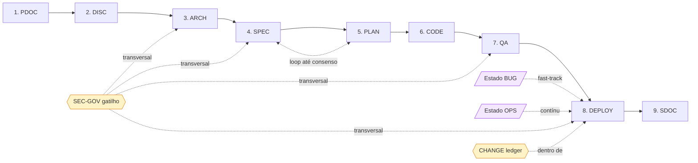

# Processo NCC-1701 — Teczi DevFlow v6.0

> **Data:** 2026-05-24
> **Status:** Draft
> **Codinome:** NCC-1701
> **Fonte canônica:** `projects/devflow/SCOPE-FINAL-V6.0-NCC-1701.md`
> **SSoT atual:** Stage 0 — Markdown versionado + decisões explícitas do Founder

---

## 1. Visão Geral

O NCC-1701 organiza a operação founder-only da Teczilabs em:

- **9 fases numeradas** sequenciais (mas com proporcionalidade P/M/G);
- **2 estados não numerados** (BUG fast-track, OPS contínuo);
- **2 governanças transversais** (SEC-GOV por gatilho, CHANGE dentro de DEPLOY).

Tudo opera com o Founder no gate. Codex, CLI, MCP e Skills são potencializadores futuros.

---

## 2. Princípios Operacionais

### Herdados do SCOPE-FINAL §4

1. **Operação interna primeiro** — tudo existe para alavancar a Teczilabs agora.
2. **Founder-only** — Carlos aprova estados, gates e direção.
3. **Context-First** — artefato só existe se melhora decisão, contexto ou execução.
4. **Spec-Driven Development** — código nasce de especificação ou bug controlado.
5. **Proporcionalidade simples** — P/M/G reduz atrito, não vira sistema de pontuação.
6. **Security cross** — Kevin participa como lente transversal; SEC-GOV existe por gatilho.
7. **Estado real vence** — código, build, teste e operação superam narrativa antiga.
8. **Reuso antes de criação** — antes de criar, procurar decisão, artefato, padrão e componente existente.
9. **Sem mercado por enquanto** — comercialização, pricing e produto ficam fora da v6.0.
10. **Evolução por dor real** — se gargalo aparecer, Founder sinaliza e a subversão corrige.

### Regras operacionais desta materialização

- **R1 — Stage 0 honesto:** v6.0 inicial opera em Markdown. Não finge automação que não existe.
- **R2 — Proof Pack proporcional:** P opcional · M recomendado · G/release/incidente/arch obrigatório.
- **R3 — OPS-EVENT mínimo:** template existe, taxonomia completa não.

---

## 3. Modelo Operacional

### 3.1 Fases

| # | Fase | Lead | Objetivo | Gate |
|---|---|---|---|---|
| 1 | PDOC | Leo/Denis | Registrar projeto, organizar estrutura | Founder valida estrutura |
| 2 | DISC | Marty | Delimitar oportunidade, In/Out/Later, SCOPE | Founder aprova recorte |
| 3 | ARCH | Oscar | Arquitetura, impactos, ADRs | Founder aprova decisão arquitetural |
| 4 | SPEC | Albert | SPEC + P/M/G + segurança | Founder aprova SPEC |
| 5 | PLAN | Nico | Plano proporcional, resolve drift SPEC-PLAN | Founder aprova PLAN/Letscode |
| 6 | CODE | Nikola | Implementar bloco/demanda | Build/checks + Founder valida |
| 7 | QA | Linus | QA-CR + QA-Func + QA-SEC proporcional | Founder Go/No-Go |
| 8 | DEPLOY | Steve+Tom, Vint executor | Release, CHANGE, deploy, smoke | Deploy aprovado |
| 9 | SDOC | Denis/Howard | Documentação pós-fluxo quando acionada | Founder valida |

### 3.2 Estados

| Estado | Lead | Quando usar | Regra |
|---|---|---|---|
| BUG | Bill | Defeito real ou regressão | Fast-track com RCA proporcional |
| OPS | Vint | Evento operacional | Não refinar até produto final; OPS-EVENT mínimo |

### 3.3 Governanças transversais

| Governança | Dono | Regra |
|---|---|---|
| SEC-GOV | Kevin | Acionada por gatilho ou decisão do Founder |
| CHANGE | Steve+Tom (Tom dono do registro) | Vive dentro de DEPLOY |

### 3.4 Diagrama de fluxo

---

## 4. SSoT Manual / Stage 0

Na v6.0 inicial, o SSoT é **operacional**, mas ainda **não tecnológico**.

Ele é composto por:

- **Markdown versionado** em git;
- **Decisões explícitas do Founder** registradas em artefatos canônicos;
- **Gates registrados** como linha textual em SPEC/PLAN/QA/DEPLOY;
- **Disciplina de recuperação de contexto** — o Founder relê os artefatos vigentes antes de avançar.

Codex, CLI e MCP serão a **materialização tecnológica futura** desse SSoT. A v6.0 não depende deles para existir como método interno.

> Não chame esta versão de "automação agêntica governada". Chame de "operação documental disciplinada com Founder no gate".

---

## 5. P/M/G — Classificação por tamanho operacional

| Classe | Definição | Exemplo |
|---|---|---|
| **P** Pequena | Subitem, ajuste ou complemento de funcionalidade existente | Ajustar validação, copy, layout local |
| **M** Média | Melhoria relevante em funcionalidade existente OU uma nova funcionalidade | Novo fluxo contido, nova tela, novo endpoint |
| **G** Grande | N funcionalidades, várias frentes ou entrega que precisa de decomposição | Módulo novo, produto novo, conjunto de features |

**Sem gatilhos duros.** Sem modificadores de risco/segurança/arquitetura/release. Se a classificação gerar dúvida, Albert e Nico iteram até consenso. Carlos interrompe quando considerar suficiente.

### Efeito prático por unidade

| Unidade | P | M | G |
|---|---|---|---|
| DISC | Normalmente skip, exceto ambiguidade | Opcional | Recomendado |
| ARCH | Skip se sem impacto | Condicional | Recomendado quando houver impacto |
| SPEC | Enxuta | Completa na demanda | Completa e estruturada |
| PLAN | Embutido ou curto | Separado | Separado por blocos/TASKs |
| CODE | Direto e localizado | Blocos contidos | Blocos sequenciais |
| QA | Focado | Funcional + regressão | Amplo e por bloco |
| DEPLOY | Se houver release | Se houver release | Se houver release |
| SDOC | Apenas se Founder pedir ou release final | Idem | Idem |

---

## 6. Loop Albert–Nico

- Albert classifica P/M/G na SPEC.
- Nico tem **direito formal** de criticar a classificação no PLAN.
- O loop é **ilimitado até consenso**.
- O Founder decide quando parar.

(Decisão herdada: Q9 Founder)

---

## 7. Gate Model — tudo Founder-only

Na v6.0 inicial, **nenhum gate é automático**:

- Nenhuma persona aprova artefato vigente sozinha.
- Nenhum agente promove estado sozinho.
- Nenhuma decisão crítica é delegada para skill/CLI/MCP/Codex.
- Carlos pode pedir recomendação, mas a decisão é dele.

Subversões futuras podem delegar checks objetivos se Carlos identificar gargalo real (precedente: o próprio P/M/G surgiu de uma dor concreta).

---

## 8. Personas Ativas (14)

| Persona | Papel no NCC-1701 |
|---|---|
| **Leo** | Orquestra fases, decide quem chamar, consolida contexto |
| **Marty** | Lidera DISC; evita feature factory |
| **Albert** | Lidera SPEC; explicita requisitos e P/M/G proposto |
| **Oscar** | Lidera ARCH quando há impacto arquitetural |
| **Nico** | Lidera PLAN; desafia P/M/G; reduz drift SPEC↔execução |
| **Nikola** | Implementa CODE no escopo aprovado |
| **Linus** | Valida qualidade, regressão e critérios de aceite |
| **Bill** | Conduz BUG/RCA; correção localizada |
| **Steve** | Lidera narrativa de release; co-lidera DEPLOY |
| **Tom** | Co-lidera DEPLOY: versionamento, commits, tags, changelog |
| **Vint** | Executa infra/deploy; pode recomendar No-Go operacional |
| **Kevin** | Cross-cutting; lidera SEC-GOV quando acionado |
| **Denis** | Organiza conhecimento, SCOPE, SDOC, consistência documental |
| **Howard** | Acionado pelo Founder para discovery técnico, DRIFT, doc as-is |

Outras personas institucionais (Sun, Voltaire, Mammon, Grace, Alan, Andy, Ada, Peter, Florence, Fred, Don) podem ser chamadas por Leo quando a demanda exigir — não fazem parte do fluxo base.

---

## 9. Codex, CLI, MCP e Skills — potencializadores futuros

### 9.1 Sequência declarada pelo Founder

1. Desenvolver DevFlow v6.0 como método operacional interno. **← onde estamos**
2. Montar estrutura Codex (`project` + `codex` domains).
3. Montar estrutura de Skills.
4. Validar integração DevFlow + Codex + Skills.
5. Definir CLI/MCP quando a maturidade exigir.

### 9.2 SSoT em dois estágios

| Estágio | Fonte operacional |
|---|---|
| **v6.0 inicial (Stage 0)** | Markdown versionado + decisões do Founder |
| **Futuro Codex** | `project` + `codex` com metadados, estado e relações |

### 9.3 `project` vs `codex` (mental model, ainda não tecnológico)

- `project`: memória do que está sendo feito — intenção viva + artefatos do DevFlow.
- `codex`: memória do que foi feito — estado real do software + doc as-is.

Essa separação **conceitual** já pode reger a organização física de pastas dos produtos (`/projects/{prod}/` × estado real no repositório do produto) — facilita migração futura.

---

## 10. Security

| Nível | Quando ocorre | Responsável |
|---|---|---|
| Security-by-design | SPEC/ARCH/PLAN com superfície relevante | Albert/Oscar/Nico + Kevin |
| Check intrabloco | CODE/QA com dados/auth/infra/risco | Nikola/Linus + Kevin |
| QA-SEC | Antes de release relevante ou quando `qa-sec` marcado | Linus + Kevin |
| SEC-GOV | Por gatilho ou decisão do Founder | Kevin |

### Gatilhos SEC-GOV

- auth/autorização;
- dados sensíveis;
- integração externa relevante;
- mudança em infra;
- release final;
- incidente;
- exposição pública;
- mudança em agentes/skills/permissão/Codex/CLI/MCP;
- solicitação explícita do Founder.

Kevin pode recomendar No-Go, mas a decisão final é do Founder.

---

## 11. SDOC, DRIFT e Howard — sob demanda

### SDOC
Roda **apenas** quando:
- há versão final elegível para release; **ou**
- Carlos/operador solicita explicitamente.

(Q11 Founder)

### DRIFT / Howard
Roda **apenas** por solicitação explícita do Founder/operador. Sem gatilhos automáticos, sem gatilhos "recomendados".

(Q12 Founder — descartado intencionalmente o ajuste do GPT-PARECER-01 §4.2 que sugeria lista de gatilhos recomendados)

---

## 12. OPS + OPS-EVENT mínimo

OPS permanece estado reconhecido, **não refinado** até pelo menos um produto em versão final (Q15 Founder).

### O que existe hoje

- Estado OPS reconhecido (ver `states/OPS.md`).
- Template `OPS-EVENT.md` mínimo (ver `templates/OPS-EVENT.md`):
  - data, evento, impacto, decisão, ação tomada, rollback (quando houver), aprendizado.

### O que NÃO existe ainda

- Taxonomia completa de tipos de evento;
- Classificação de severidade;
- Fluxo de roteamento de incidente;
- SLOs ou monitoramento estruturado.

Quando aparecer necessidade operacional real (produto em versão final + primeiro incidente concreto), Carlos aciona refinamento.

---

## 13. DEPLOY e CHANGE

| Responsável | Papel |
|---|---|
| **Steve** | Release notes, narrativa de entrega, comunicação |
| **Tom** | Versionamento, commits, tags, changelog, governança Git |
| **Vint** | Infra, ambiente, deploy, smoke, No-Go operacional recomendatório |

### CHANGE dentro de DEPLOY

Vive dentro de DEPLOY. Registra:

- o que mudou;
- por que mudou;
- impacto esperado;
- versão interna;
- comunicação necessária;
- rollback quando aplicável;
- evidência apenas se contexto exigir (Q14 Founder).

### Versionamento

- Comunicação externa **sem tag de ciclo**.
- Antes de lançamentos, tags de ciclo podem aparecer na comunicação interna.
- SemVer externo só importa quando houver produto público.

(Q16 Founder)

---

## 14. Proof Pack Proporcional

Ajuste incorporado do **GPT-PARECER-01 §5.3**.

| Tipo de demanda | Proof Pack |
|---|---|
| **P** | Opcional |
| **M** | Recomendado |
| **G** | Obrigatório |
| Release final | Obrigatório |
| Bug crítico / incidente | Obrigatório |
| Mudança arquitetural | Obrigatório |

Template: [`templates/PROOF-PACK.md`](templates/PROOF-PACK.md).

---

## 15. Métricas do Proof Pack

Conjunto operacional inicial (~9 métricas, Q19 Founder · SCOPE-FINAL §15.1):

| Métrica | Para que serve |
|---|---|
| `founderContextReloadCount` | Medir quanto Carlos precisa reexplicar contexto |
| `reuseRate` | Medir reaproveitamento de artefatos/decisões/componentes |
| `gateReworkRate` | Medir retrabalho em gates |
| `escapedDefects` | Medir defeitos que passam do QA/deploy |
| `driftDetectedCount` | Medir divergência entre intenção e estado real |
| `claimSourceCoverage` | Medir cobertura de fontes para claims relevantes |
| `tokenCostByPhase` | Medir custo de IA por fase |
| `artifactJunkScore` | Identificar documentação sem valor operacional |
| `policyViolations` | Medir bloqueios/violações (quando houver Control Plane) |

---

## 16. Roadmap de materialização

| Ordem | Entrega |
|---|---|
| 1 | SCOPE final NCC-1701 ✓ |
| 2 | SPEC NCC-1701 ✓ |
| 3 | Materialização inicial NCC-1701 (este conjunto) ← aqui |
| 4 | Operação interna em demanda real (dogfood Teczi) |
| 5 | Primeiro Proof Pack registrado |
| 6 | Subversões v6.x conforme dor real |
| 7 | Codex (`project` + `codex` domains) |
| 8 | Skills automatizadas com contratos |
| 9 | CLI/MCP quando a plataforma exigir |
| 10 | Avaliação v7.0 apenas se Teczi + frente enterprise indicarem maturidade vendável |

---

## 17. Critério de Sucesso (do SCOPE-FINAL §20)

O NCC-1701 terá sucesso se Carlos conseguir operar a Teczilabs com:

- menos perda de contexto;
- menos drift SPEC-PLAN-CODE;
- mais clareza de decisão;
- menos documentação inútil;
- mais segurança transversal;
- mais previsibilidade nas demandas P/M/G;
- melhor reaproveitamento de conhecimento;
- software real entregue com qualidade.

**O sucesso não é vender DevFlow. O sucesso é alavancar a Teczilabs.**

---

## 18. Citação

> *Espaço, a fronteira final. Estas são as viagens da nave estelar Enterprise. Sua missão contínua: explorar estranhos novos mundos. Buscar novas formas de vida e novas civilizações. Audaciosamente ir aonde nenhum homem jamais esteve.*
>
> *Space, the final frontier. These are the voyages of the starship Enterprise. Its continuing mission: to explore strange new worlds. To seek out new life and new civilizations. To boldly go where no man has gone before.*
