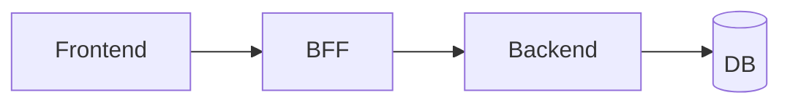

# DAS — {Nome do Produto}

> **Documento de Arquitetura de Solução**
> **Data:** {YYYY-MM-DD}
> **Versão:** {n} · **Status:** Draft | Vigente | Superseded
> **Lead:** Oscar · **Co-lead:** Vint (INFRA-ARCH)
> **Vive em:** domínio `project`

---

## 1. Visão arquitetural

Diagrama (mermaid quando possível) + 1 parágrafo de descrição.

## 2. Camadas

| Camada | Responsabilidade | Tecnologia |
|---|---|---|
| ... | ... | ... |

## 3. Decisões arquiteturais ativas

Lista de ADRs vigentes:

- [ADR-001](adrs/ADR-001.md) — ...
- [ADR-002](adrs/ADR-002.md) — ...

## 4. Contratos externos

APIs, schemas, integrações que o produto expõe ou consome.

## 5. Dados

Modelo de dados de alto nível (sem esquema de tabela completo).

## 6. Segurança (overview)

Pontos onde a superfície é sensível. Detalhe técnico vive em SEC-GOV/QA-SEC.

## 7. Infra (overview)

Referência para [`INFRA-ARCH.md`](INFRA-ARCH.md) quando aplicável.

## 8. Não-decisões

Coisas que **não** estão decididas (deliberadamente). Marcar como `pending` ou `out-of-scope`.

## 9. Histórico

| Versão | Data | Mudança | Aprovado por |
|---|---|---|---|
| 1 | {data} | Criação | Founder |

---

## Quando NÃO usar este template

- Para decisão específica e irreversível: usar [`ADR.md`](ADR.md).
- Para infra detalhada: usar [`INFRA-ARCH.md`](INFRA-ARCH.md).
- Para documentar estado real após código: usar SDOC, não DAS.
- DAS é **decisão**, não inventário "como está".
