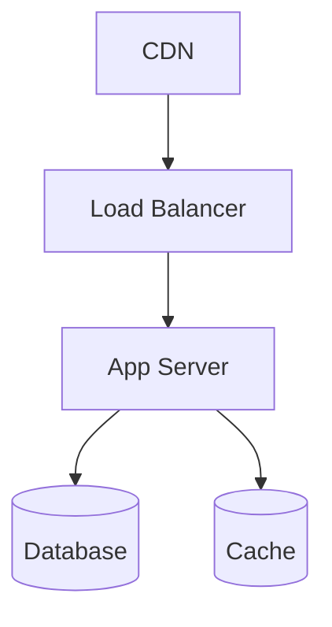

# INFRA-ARCH — {Nome do Produto}

> **Data:** {YYYY-MM-DD}
> **Versão:** {n} · **Status:** Draft | Vigente | Superseded
> **Lead:** Vint · **Co-lead:** Oscar
> **Vive em:** domínio `project`

---

## 1. Topologia atual

Diagrama de infra (mermaid).

## 2. Componentes

| Componente | Provedor | Plano | Região |
|---|---|---|---|
| ... | ... | ... | ... |

## 3. Rede

VPC, subnets, security groups, DNS.

## 4. Persistência

Bancos, backups, retenção.

## 5. Observabilidade

Logs, métricas, alertas (mínimo viável).

## 6. Credenciais e segredos

Política de gestão (sem listar segredos).

## 7. Deploy

Pipeline, ambientes, smoke.

## 8. Custo (overview)

Sem valor absoluto. Drivers de custo.

## 9. INFRA-TODOS

Pendências operacionais com criticidade informal:

| ID | Item | Criticidade | Evidência |
|---|---|---|---|
| ... | ... | Critico / Alto / Médio / Baixo | apenas se contexto exigir (Q14) |

## 10. Histórico

| Versão | Data | Mudança | Aprovado por |
|---|---|---|---|
| 1 | {data} | Criação | Founder |

---

## Quando NÃO usar este template

- Para arquitetura de aplicação: usar [`DAS.md`](DAS.md).
- Para evento operacional pontual: usar [`OPS-EVENT.md`](OPS-EVENT.md).
- Evidência de INFRA-TODOS é **apenas se contexto exigir** (Q14 Founder).
